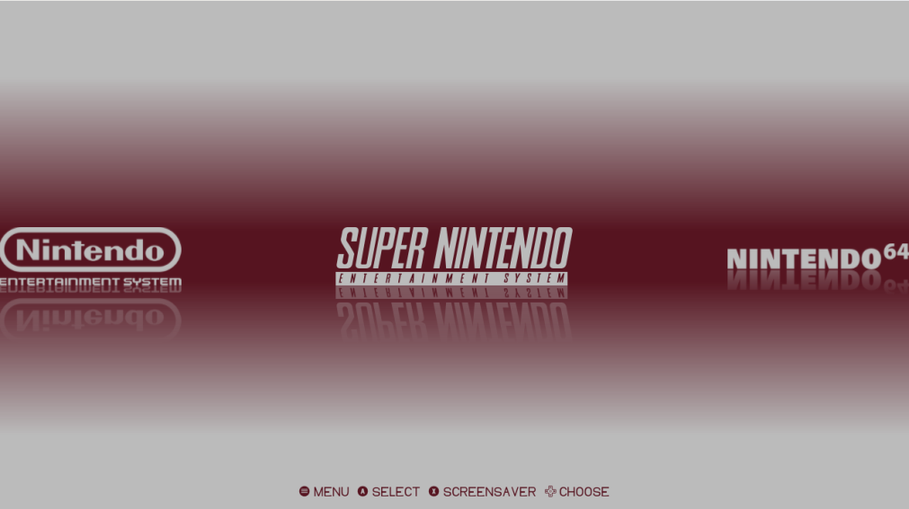
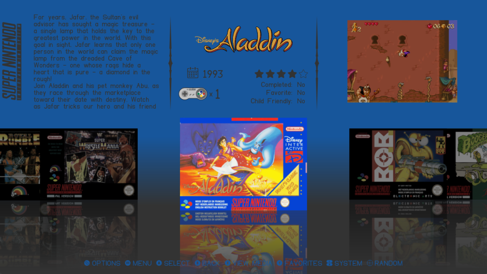

# elegance_es_de for EmulationStation Desktop Edition

Elegance is a theme set for ES-DE that supports all systems as well as the latest application features.

The following options are included:

4 variants:

- Solid with videos
- Solid no videos
- Color with videos
- Color no videos

7 color schemes:

- Yellow
- Classy
- Hyrule
- White/Blue
- Grey/Blue
- Grey/Purple
- White/Red

4 aspect ratios:

- 16:9
- 4:3
- 16:10
- 21:9

